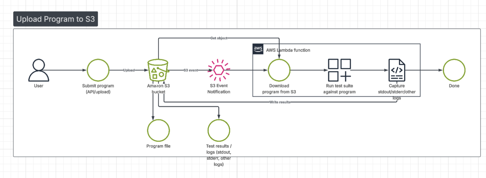
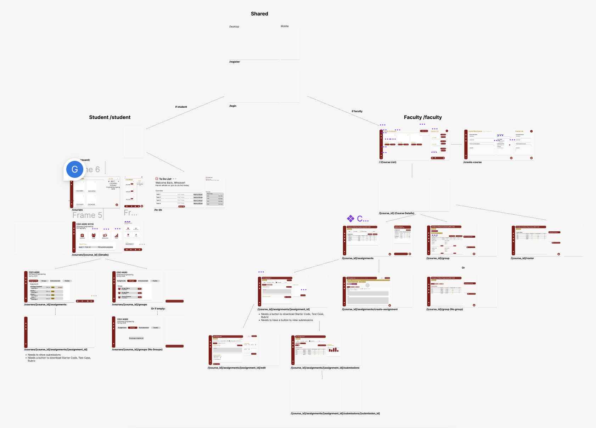

# Code Grader

An artificial intelligence–based code grading system developed as part of the ULM CSCI 4060 Software Engineering course.

## Table of Contents:
1. [Members](#members)
2. [Startup Guide](#startup-guide)
3. [Architecture](#architecture)
   - [ER-Diagram](#entity-relationship-diagram-erd)
   - [UI Mockups](#ui-mockups)
4. [Documentation](#documentation)

## Members:

1. George Khawas (Project Lead)
   - Coordinated frontend & backend
   - Designed database schema, frontend & backend project structure
   - Setup and administered the servers
   - Designed the software architecture
   - Managed the development cycle using Docker Compose
   - Designed accounts & courses model, view, serializers
   - Designed tests for all model, view, serializer & permissions
   - Designed the frontend authentication middleware and request middleware for UX and communication
2. Sujan Shrestha (Backend Engineer: Developed)
   - Developed APIs
3. Sabin Chalise (Frontend Engineer)
   - Developed frontend components
   - Designed frontend's student layout
4. Sumit Shrestha (UI/UX Designer)
   - Designed frontend's faculty layout
5. Aiden Jones (Documentation)
   - Documented the backend in PostmanAPI
   - Documented the backend in repo markdown

## Startup Guide

**Prerequisites:** 
- Docker: You must have Docker and Docker Compose installed.

****After completing the prerequisites:**
1. First create an .env file at the project root (Ask George for .env variables)
2. Run the following code to run the program:
    > $docker compose build --no-cache  
    > $docker compose up -d  
3. Run python migrate command
    > $docker compose run --rm backend python manage.py migrate  
4. Run the piston package install command
    > cd piston-engine/cli && npm i && cd -
    > piston-engine/cli/index.js ppman install python=3.9. 
4. View frontend at localhost:3000 & backend at localhost:8000
5. To turn off use: 
    > $docker compose down -v  

## Documentation

The documentation can be viewed at:
1. [Frontend Documentation](./docs/frontend/README.md)
2. [Backend Documentation](./docs/backend/README.md)

## Architecture

Below you can read about the technical architecture associated with this software.

## Entity Relationship Diagram (ERD)

*Designed by George Khawas*

## Architecture Flow

*Designed by George Khawas*

## UI Mockups

*Structured by George Khawas | Designed by Sumit Shrestha and Sabin Chalise*

[Link to figma project](https://www.figma.com/design/RXazzGvzgKIsMya0im1IPG/Code-Grader?node-id=0-1&t=Bh31kDoC7w8zXNUT-1)

