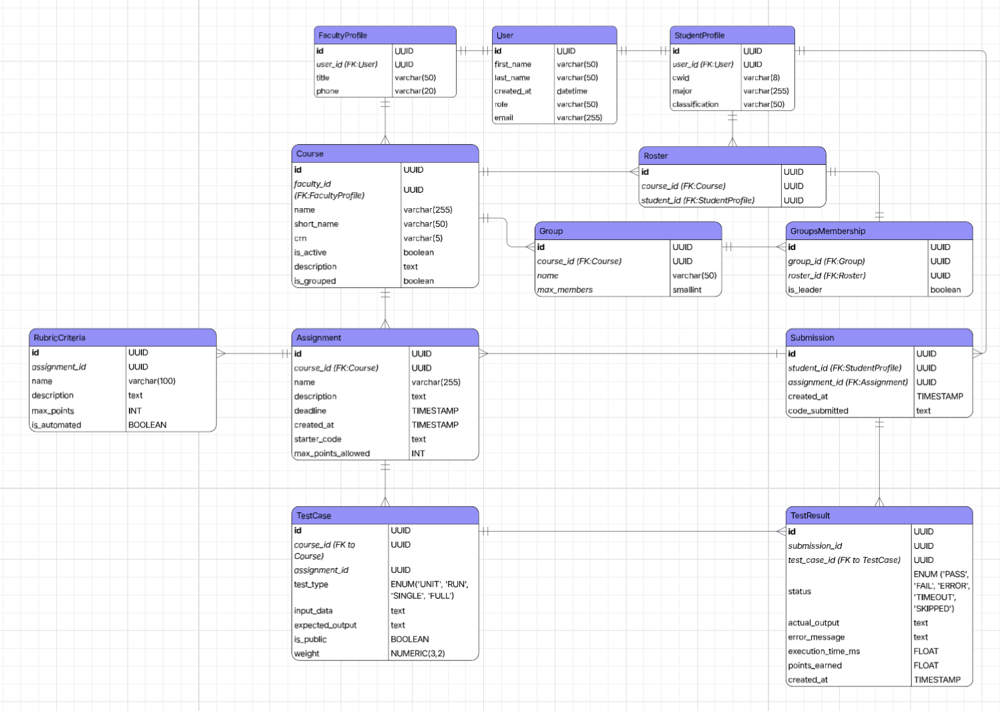

# Code Grader

An artificial intelligence–based code grading system developed as part of the ULM CSCI 4060 Software Engineering course.

### Members:

1. George Khawas (Project Lead)
   - Coordinated frontend & backend
   - Designed database schema, frontend & backend project structure
   - Setup and administered the servers
   - Designed the software architecture
   - Managed the development cycle using Docker Compose
2. Sujan Shrestha (Backend Engineer: Developed)
   - Developed APIs
3. Sabin Chalise (Frontend Engineer)
   - Developed frontend components
4. Sumit Shrestha (UI/UX Designer)
5. Aiden Jones (Documentation)

# Startup Guide

## Prerequisites: Make sure to download latest version of docker and docker commandlinetools

After completing the prerequisites:
1. First create an .env file at the project root
2. Use the following commands in project directory in terminal/command-line to set an alias:
    > Windows: Set-Alias dcdev docker compose -f docker-compose.yml -f docker-compose.dev.yml
    > Mac/Linux: alias dcdev='docker compose -f docker-compose.yml -f docker-compose.dev.yml'
3. Run the following code to run the program:
    > dcdev up -d
4. View frontend at localhost:3000 & backend at localhost:8000
5. To turn off use: 
    > dcdev down -v

# Architecture

Below you can read about the technical architecture associated with this software.

## Entity Relationship Diagram (ERD)

*Designed by George Khawas*
